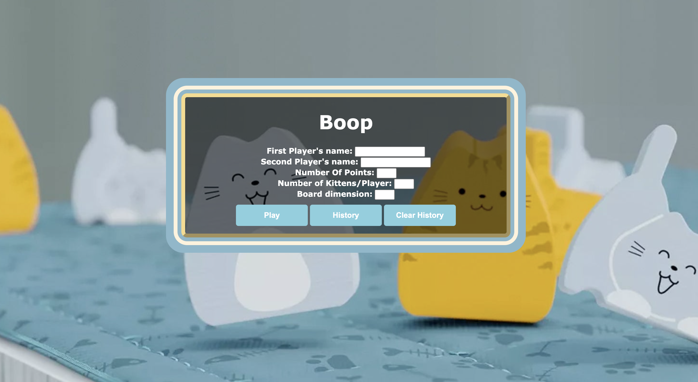
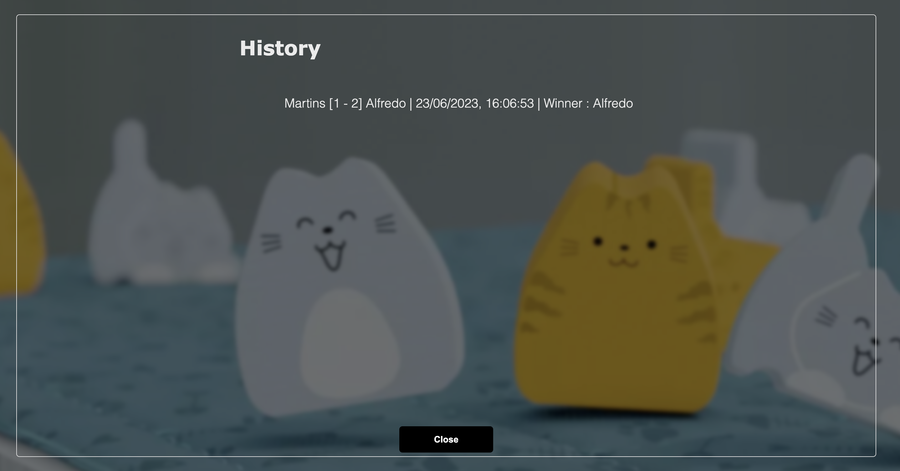
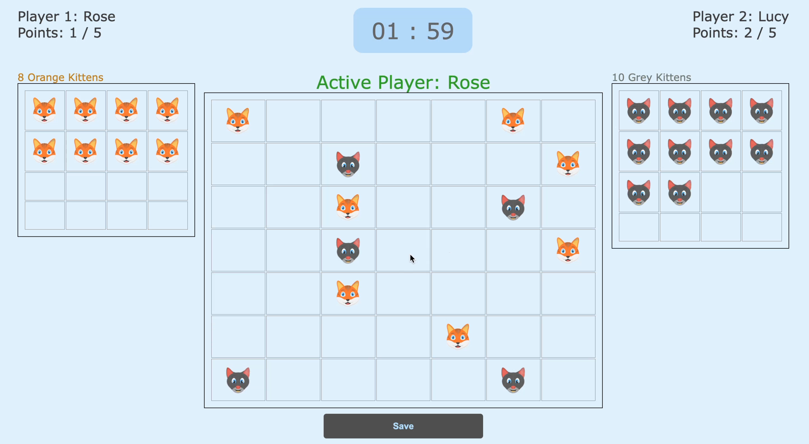
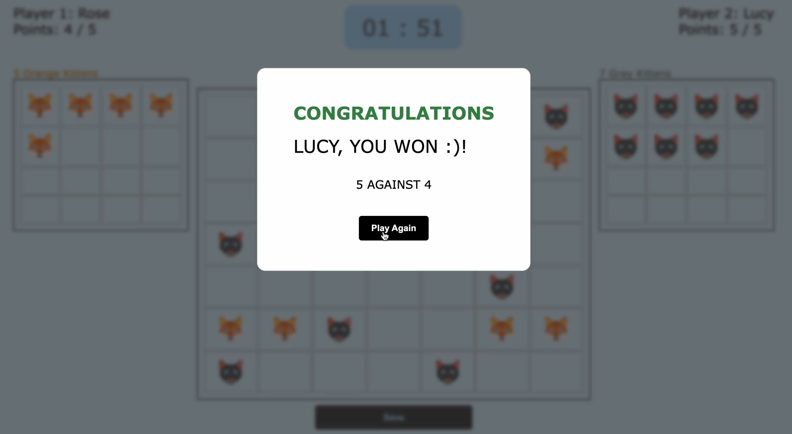

# Boop Game Documentation

The Boop Game is a simplified version of the board game "Boop" implemented as a browser-based application using native JavaScript. The goal of the game is to have three kittens of the same color next to each other horizontally, vertically, or diagonally on a 6x6 grid.

<embed src="/boop_rules_v1.pdf" type="application/pdf" width="100%" height="600px" >

## Demo Prototype

## Screenshots

## Features

- Players take turns placing kittens on the board.
- Kittens are pushed away from the placement location, including off the board and back to the player's bench.
- When three kittens of the same color are adjacent, the player earns a point and the kittens are returned to the bench.
- The game ends when a player reaches a specified target score or when a player has all their kittens on the field.
- The game can be customized with player names, target score, board dimensions, and number of kittens per player.
- Recent game results are displayed on the starting screen and persist even after closing the page.
- Sound effects are provided for various game activities.

## Installation and Usage

To play the Boop Game, follow these steps:

1. Clone the repository or download the source code.
2. Open the `index.html` file in a web browser.
3. On the starting screen, enter the player names, target score, board dimensions, and number of kittens per player.
4. Click the "Start Game" button to begin.
5. Players take turns placing kittens on the board by clicking on empty cells or dragging and dropping kittens from the bench.
6. After each placement, adjacent kittens are pushed away according to the game rules.
7. When three kittens of the same color are adjacent, the player earns a point and the kittens are returned to the bench.
8. The game ends when a player reaches the target score or has all their kittens on the field at the same time.
9. To start a new game with the same settings, simply click the "New Game" button.

## Dependencies

The Boop Game is implemented using native JavaScript, HTML, and CSS. No additional frameworks or libraries are required.

## Credits

The Boop Game implementation is created by `Alfredo Martins`.
